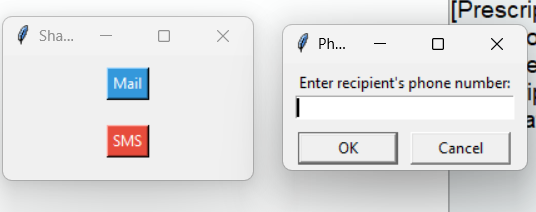
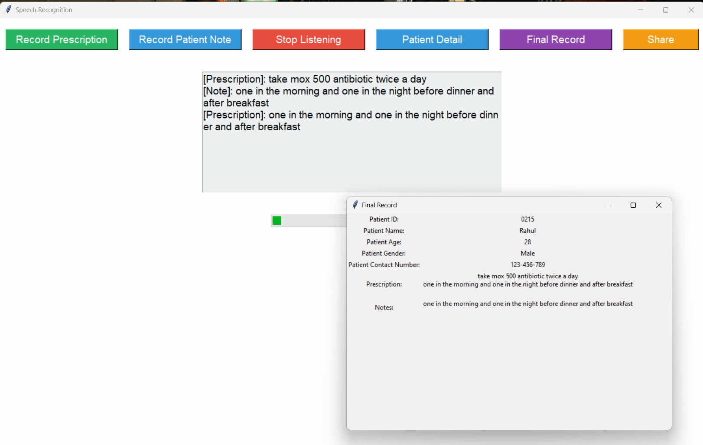

# Med-Voice

**MED-VOICE** is a Python application utilizing Tkinter for the GUI and speech recognition for converting spoken prescriptions and patient notes into text. It manages patient details and supports data sharing via email and SMS.

## Features
- **Speech Recognition**: Records prescriptions and patient notes using the microphone.
- **Patient Details**: Saves and displays patient information (ID, name, age, gender, contact number).
- **Final Record**: Provides a comprehensive view of patient details, prescriptions, and notes.
- **Sharing Options**: Allows sharing recorded data via email (using Mailgun API) and SMS (using Twilio).

## Requirements
- Python 3.x
- `tkinter`
- `speech_recognition`
- `PIL` (Python Imaging Library)
- `requests`
- `twilio` (if using SMS feature)

## Installation

1. **Clone the repository:**

    ```bash
    git clone https://github.com/priyanshuraj009/Med-Voice.git
    cd Med-Voice
    ```

2. **Install dependencies:**

    ```bash
    pip install -r requirements.txt
    ```

## Usage

1. **Run the application:**

    ```bash
    python Med-Voice.py
    ```

2. **Use the GUI buttons to:**
   - Record prescriptions and notes.
   - Manage patient details.
   - View the final record.
   - Share data via email or SMS.

   Ensure you have valid credentials (like Mailgun API key, Twilio credentials) in the script if using email or SMS features.

## Screenshots
- 
- 

## Contributing
Contributions are welcome! For major changes, please open an issue first to discuss what you would like to change.

1. **Fork the repository.**
2. **Create your feature branch:**

    ```bash
    git checkout -b feature/AmazingFeature
    ```

3. **Commit your changes:**

    ```bash
    git commit -am 'Add some feature'
    ```

4. **Push to the branch:**

    ```bash
    git push origin feature/AmazingFeature
    ```

5. **Open a pull request.**

## Screenshots


